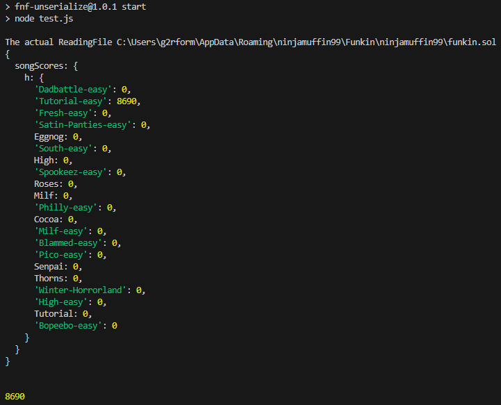

<h1 align="center">FNF-Unserialize</h1>

> A module for serializing data from the Friday Night Funkin Game!

<div align="center">
  <a href="https://www.npmjs.com/package/fnf-unserialize">
    
  </a>


</div>

## Install

With [npm](https://npmjs.org/) installed, run

```bash
npm install fnf-unserialize
```

## Links

- [Link of FNF app](https://github.com/ToniPortal/FNF-Electron)

- [Repo](https://github.com/ToniPortal/compagnioncube)

- [Bugs](https://github.com/ToniPortal/compagnioncube/issues)

## Usage

You need find file :
-Psyh engine : **%appdata%/ShadowMario/nameofyourfnf**
-Fnf : **%AppData%/Roaming/ninjamuffin99/Funkin/ninjamuffin99**

```js
const fnf = require("./index.js");

//Create the json from the game and return it(it parsed into js object);
console.log(fnf.create(`${process.env.APPDATA}/ninjamuffin99/Funkin/ninjamuffin99`));

console.log("\n") // For have a <br> in console

// Read the json created(it parsed into js object);
var r = fnf.read();

//And here you see all the song normally !(The json change verigy before !)
console.log(r.songScores.h["Tutorial-easy"]);

```

outputs



## Built With

- [Node](https://nodejs.org/fr/)
- [NPM](https://npmjs.org/)
- [Path](https://www.npmjs.com/package/path)

## Future Updates

- [] If the community requests it, it will be updated !!

## Author

**ToniPortal**

- Contact discord **toniportal**
- [My Github profile](https://github.com/ToniPortal)
- [My email for professional helping](mailto:pastre.toni?subject=Help%for%fnf-serialize)

## 🤝 Support

Feature requests are welcome!

Give a ⭐️ if you like this project !

## License  

[](https://github.com/ToniPortal)  
